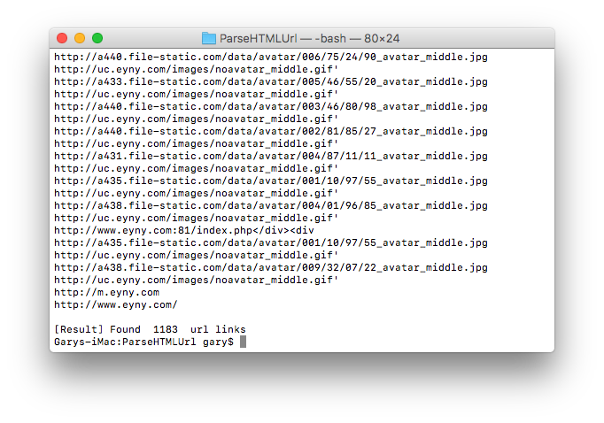

# ParseHTMLUrl
A python script that can parse all url link in html files

##Configuration
To customize usage, add one of the following variables:

- `FILENAME`: Filename to use when not provided as a CLI argument, `test.html` by default
filename

##Usage
```
$ cd thisrepo
$ python parseHTMLUrl.python "filename"

```

##Result


- Show count of total parsed url
- Show all urls
